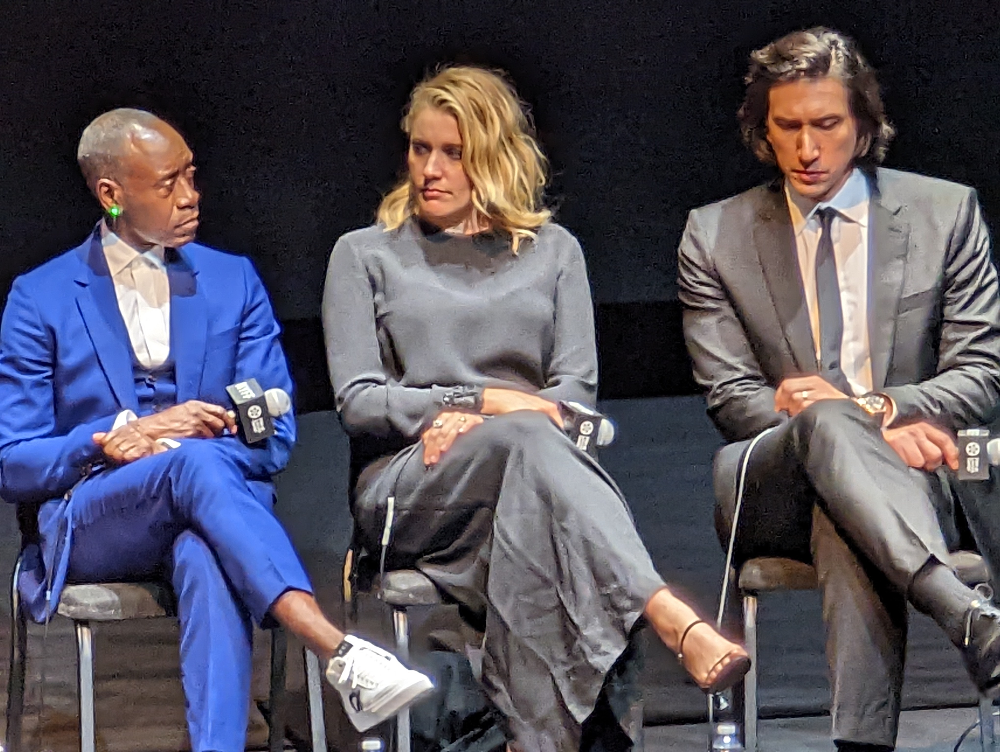

---
categories:
- Drama
- US
- See it
date: 2022-09-30
description: "Opening Night: Noah Baumbach's adaptation of the Don
  DeLillo novel"
format:
  html:
    contents: false
    toc: true
    sidebar: false
image: poster.jpg
title: White Noise

---

::: {layout=[[75,25]]}

## BLUF

See it. It\'s not really like anything else. Excellent performances.
Many striking, unforgettable scenes. The closing credits alone are
almost worth the price of admission. My biggest complaint is that the
dialogue feels stilted and artificial at times, particularly at the
beginning. Maybe it got better or maybe I adjusted. Or maybe it's
intentional; this is a story about people who hide behind
words.

:::

## The \"white noise\" --- people talking over each other

Baumbach gives us "white noise" in nearly every group scene. At meals,
especially, there are many simultaneous conversations. In the discussion
after the movie one of the actors described it as "not A-B A-B but
A-A-A-A". In some ways it reminded me of Altman's layering of sound, but
the effect was more confusing. I thought this was a good touch, and it
reminded me more than a little of my own family, which can feel like five people
having six different conversations, and nobody knows everything that's
being said.

## Thoughts

In a way almost reminiscent of Wes Anderson, the movie is kind of held
aloft by a handful of standout scenes. There's a dinner scene where
Driver's character demonstrates a combination of denial and bargaining
that's both very funny and all too reminiscent of the way many people
behaved in March of 2020. Driver and Cheadle do a tandem lecture in a
lecture hall-in-the-round (are there really such things) that was kind
of amazing. The final act and the closing credits are probably worth the
price of admission.

