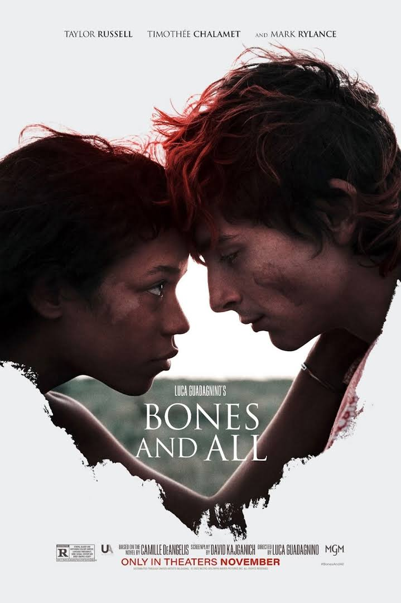

::: {layout=[[75,25]]}
# BLUF

We left after about 15 minutes. My only regret is having seen the first 15
minutes. The second graphic and realistic scene of cannibalism was too
much. 

:::

# Thoughts

There's definitely a compelling Stephen King vibe here, and (like a few other
movies at the festival) a good editor could have made this something
good. It would have been so much more cinematic to tell us about
the cannibalism without showing the acts themselves. There's so little
art in making the horror explicit.
