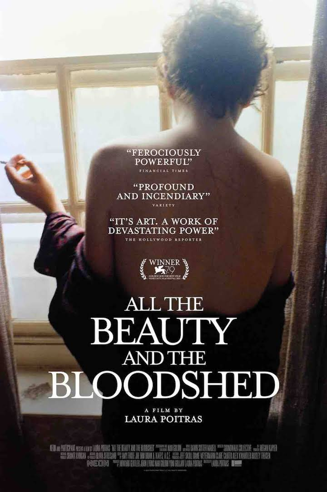

::: {layout=[[75,25]]}
# BLUF

Great documentary. See it. A terrific telling of Nan Goldin's role
creating P.A.I.N. and fighting for some measure of justice against the
Sacklers; at the same time a biography of Nan Goldin.

:::
# Thoughts

I found myself swept away by Goldin's no-bullshit honesty. She's led
what would be at least three full lives: runaway, artist,
AIDS activist, anti-opioids activist. Her life manages to span the
Vietnam war, 80's punk, the AIDS epidemic, the opioid epidemic. 

