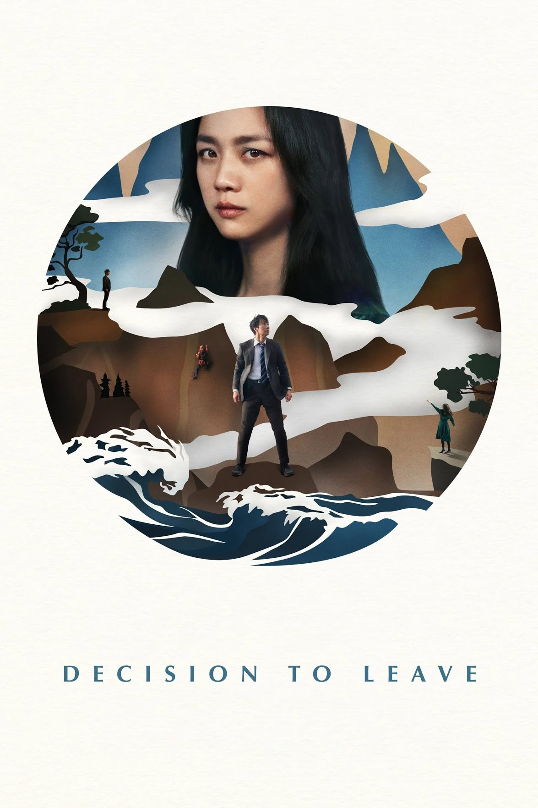
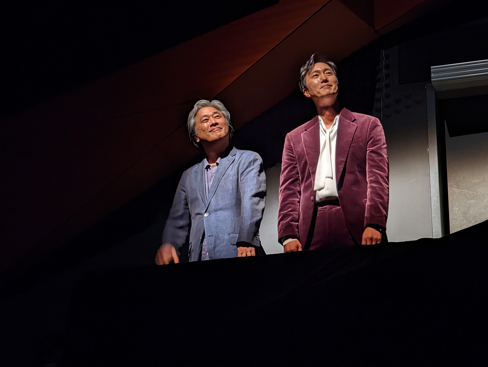

::: {layout=[[75,25]]}
# BLUF

WOW. The best movie of the film festival (so far). Riveting for every
second of its 2:18 runtime. Visually creative, a plot that combines
police procedural, noir, femme fatale, romance. Director Park described
it as a "romantic comedy with a tragic ending." Although he said it with
tongue in cheek, it was completely accurate.

:::

# Thoughts

I was stunned at the visual composition, cinematography (shots taken
from the perspective of the dead victims, great treatments of memories,
so, so much more). And a plot with a femme fatale but one who is
genuinely three-dimensional, not motivated solely by greed. So many
metaphors. So much symbolism. In a story that pulls you along.

