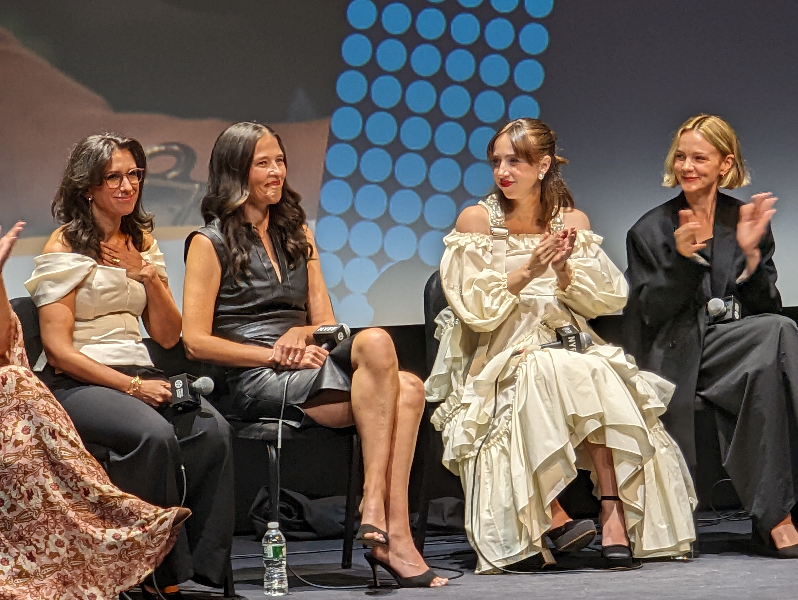

::: {layout=[[75,25]]}
# BLUF

See it. The story of Jodi Kantor and Megan Twohey's exposing of Harvey
Weinstein's many, many crimes against women and how they were covered up
by his enablers. It was gripping. The cast were terrific. It was a
trip to see Megan Twohey after seeing Carey Mulligan play her; Mulligan
really nailed Twohey's voice and physicality. 

:::

